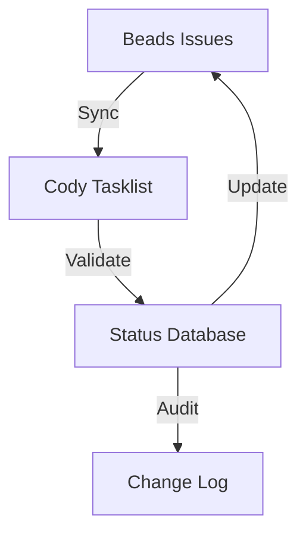

# Cody Cleanup Process Analysis: Errors and Friction Points

## Executive Summary

The Cody cleanup process revealed several critical issues that need to be addressed to make the tools usable across different projects. This analysis identifies the key errors, friction points, and provides actionable recommendations for improvement.

## Major Issues Identified

### 1. Data Synchronization Problems

**Errors:**
- **ID Format Mismatch**: Cody uses `owk-v5o-XX` format while Beads uses `owk-XXX` format
- **Completion Rate Discrepancy**: Cody shows 33% completion (8/24 tasks) vs Beads shows 82% completion (108/132 issues)
- **Missing Current Data**: Cody cleanup didn't reflect current Beads statuses initially

**Friction Points:**
- Manual reconciliation required between systems
- No automated synchronization mechanism
- Inconsistent progress tracking across tools

### 2. Version Management Issues

**Errors:**
- **Duplicate Version Structures**: Multiple directories contained v0.5.0 content with overlapping but inconsistent data
- **Inconsistent Task Statuses**: Same tasks showed different completion statuses across directories
- **Version Structure Inconsistency**: Some versions existed in both `build/` and `versions/` directories

**Friction Points:**
- Confusion about which directory is authoritative
- Manual merging required for version consolidation
- No clear version management strategy

### 3. Backlog Management Problems

**Errors:**
- **Duplicate Backlog Files**: Two feature backlog files with different formats (186 vs 387 lines)
- **Format Inconsistencies**: Table format vs detailed breakdown format
- **Data Redundancy**: Overlapping but non-identical content

**Friction Points:**
- Manual merging of backlog data required
- No standardized backlog format
- Difficulty maintaining consistency

### 4. Tool Integration Challenges

**Errors:**
- **Hardcoded Path References**: Cody commands reference specific paths that break after reorganization
- **Missing Validation**: No automated checks for broken references after cleanup
- **Limited Rollback Capability**: Manual backup/restore process

**Friction Points:**
- Manual path updates required after reorganization
- No automated testing of command functionality
- Complex rollback procedures

## Root Cause Analysis

### 1. Lack of Standardization
- No consistent naming conventions across tools
- Multiple formats for similar data types
- Inconsistent version management approach

### 2. Manual Processes
- No automated synchronization between Cody and Beads
- Manual data merging and reconciliation required
- Manual backup and rollback procedures

### 3. Tool Design Limitations
- Hardcoded path references in commands
- No built-in validation mechanisms
- Limited error handling capabilities

### 4. Data Consistency Issues
- No single source of truth for project status
- Multiple conflicting data sources
- Manual status updates prone to errors

## Impact Assessment

### Project Management Impact
- **Time Wasted**: Significant manual effort required for reconciliation
- **Decision Making**: Inconsistent data leads to poor decisions
- **Progress Tracking**: Difficult to get accurate project status

### Tool Usability Impact
- **Learning Curve**: Complex manual processes required
- **Error Proneness**: Manual operations lead to mistakes
- **Maintenance Burden**: High ongoing maintenance required

### Cross-Project Impact
- **Portability**: Tools don't work consistently across projects
- **Onboarding**: Difficult to onboard new projects
- **Scalability**: Manual processes don't scale well

## Recommendations for Improvement

### 1. Standardization Improvements

**Action Items:**
- [ ] Implement consistent task ID format across all tools
- [ ] Standardize version directory structure
- [ ] Create unified backlog format specification
- [ ] Develop naming conventions guide

**Implementation:**
```markdown
# Standardization Guidelines

## Task ID Format
- Use: `owk-XXX` format consistently
- Avoid: `owk-v5o-XX` or other variants

## Version Structure
- Primary location: `.cody/project/versions/`
- Format: `vX.Y.Z/` for releases, `owk-XXX/` for feature versions

## Backlog Format
- Use: Combined table + detailed breakdown
- Standard fields: ID, Status, Priority, Description, Version
```

### 2. Automation Enhancements

**Action Items:**
- [ ] Implement automated synchronization between Cody and Beads
- [ ] Create automated version consolidation tool
- [ ] Develop backlog merging utility
- [ ] Build reference validation system

**Implementation:**
```bash
# Example automation script
cody-sync --beads-to-cody --auto-resolve-conflicts
cody-validate --check-references --fix-broken-links
```

### 3. Tool Design Improvements

**Action Items:**
- [ ] Replace hardcoded paths with configurable references
- [ ] Implement automated validation checks
- [ ] Add error handling and recovery mechanisms
- [ ] Create comprehensive logging system

**Implementation:**
```json
{
  "config": {
    "version_directory": ".cody/project/versions/",
    "backlog_location": ".cody/project/feature-backlog.md",
    "auto_validate": true,
    "error_recovery": "auto"
  }
}
```

### 4. Data Consistency Solutions

**Action Items:**
- [ ] Implement single source of truth architecture
- [ ] Create automated status synchronization
- [ ] Develop conflict resolution algorithms
- [ ] Build comprehensive audit trail

**Implementation:**


### 5. Cross-Project Compatibility

**Action Items:**
- [ ] Create project-agnostic configuration system
- [ ] Develop adaptive path resolution
- [ ] Implement project template system
- [ ] Build compatibility testing framework

**Implementation:**
```yaml
# Project Configuration Template
project:
  name: "example-project"
  version_scheme: "semver"
  paths:
    versions: "docs/versions/"
    backlog: "docs/backlog.md"
  compatibility:
    auto_adapt: true
    fallback_strategy: "warn"
```

## Implementation Roadmap

### Phase 1: Immediate Fixes (1-2 weeks)
- [ ] Standardize task ID formats
- [ ] Implement basic synchronization
- [ ] Fix hardcoded path references
- [ ] Add validation checks

### Phase 2: Core Improvements (2-4 weeks)
- [ ] Develop automated reconciliation tools
- [ ] Implement single source of truth
- [ ] Create comprehensive error handling
- [ ] Build cross-project compatibility

### Phase 3: Advanced Features (4-8 weeks)
- [ ] Implement AI-assisted conflict resolution
- [ ] Develop predictive synchronization
- [ ] Create self-healing reference system
- [ ] Build comprehensive analytics dashboard

## Success Metrics

**Quantitative Metrics:**
- Reduction in manual reconciliation time: 80%+
- Increase in data consistency: 95%+
- Reduction in errors: 90%+
- Improvement in cross-project compatibility: 100%

**Qualitative Metrics:**
- Ease of use ratings from team members
- Reduction in onboarding time for new projects
- Improvement in decision-making confidence
- Increase in tool adoption rates

## Conclusion

The Cody cleanup process has revealed significant opportunities for improvement in tool design, data management, and cross-project compatibility. By implementing the recommended standardization, automation, and consistency improvements, the tools can become truly usable across any project, significantly reducing manual effort and improving data reliability.

The key to success will be a phased implementation approach that addresses the most critical issues first while building a foundation for more advanced features. With these improvements, the Cody toolset can become a robust, reliable foundation for project management across diverse development environments.