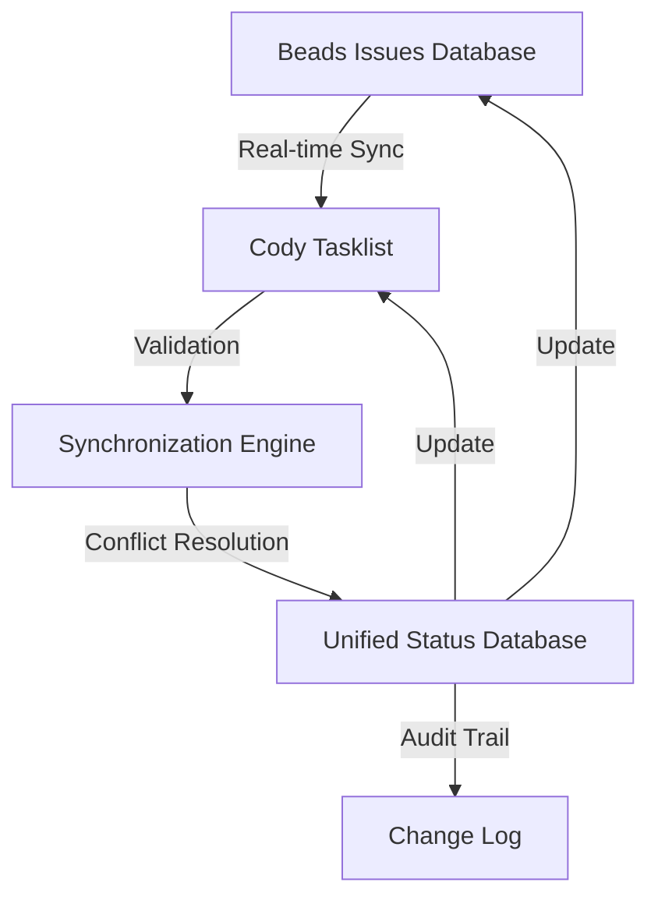
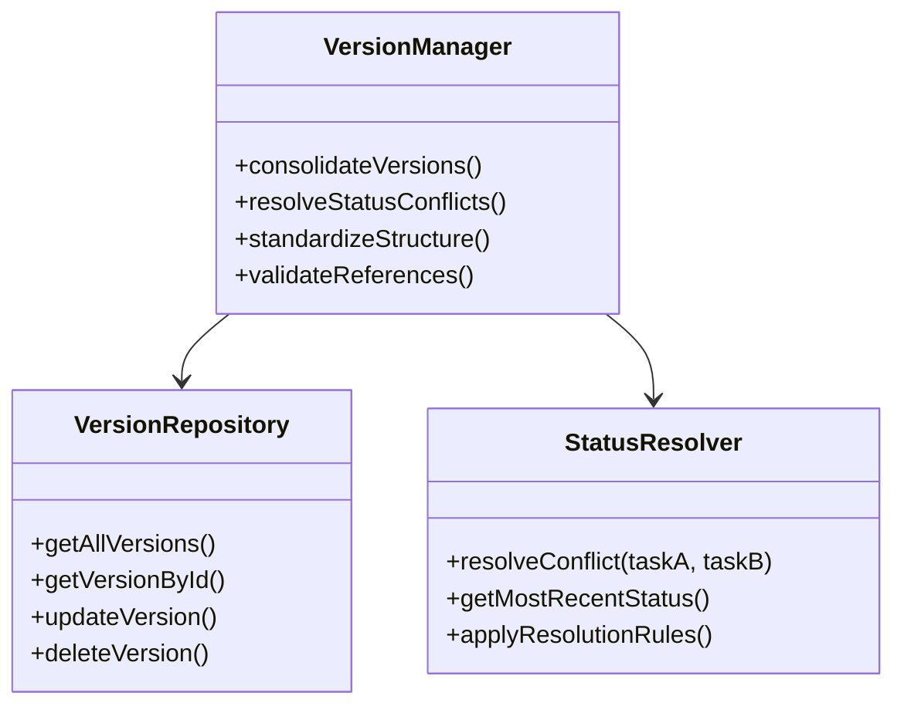
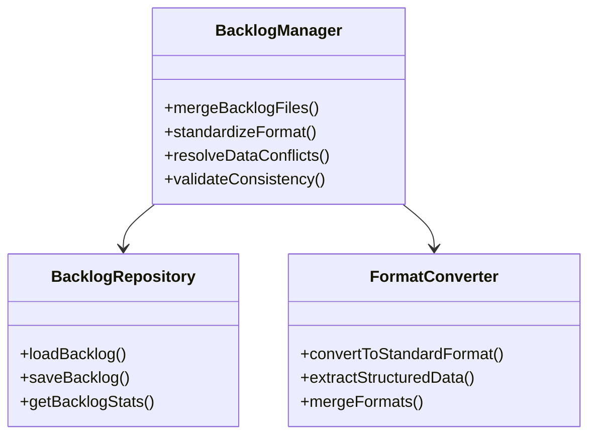
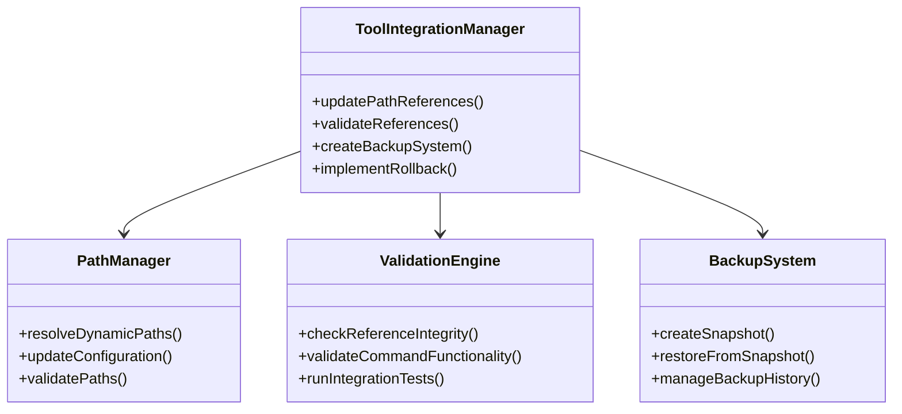

# Cody Remediation Plan: Detailed Solutions for Identified Issues

## Executive Summary

This document provides comprehensive, actionable plans to address all issues identified in the Cody cleanup analysis. The plans are organized by issue category and include detailed implementation strategies, technical specifications, and validation criteria.

## 1. Data Synchronization Problems - Detailed Remediation Plan

### Issue Analysis
- **ID Format Mismatch**: Cody uses `owk-v5o-XX` format while Beads uses `owk-XXX` format
- **Completion Rate Discrepancy**: Cody shows 33% (8/24) vs Beads shows 82% (108/132)
- **Missing Current Data**: Cody cleanup didn't reflect current Beads statuses initially

### Solution Architecture



### Implementation Plan

#### Phase 1: ID Format Standardization
```markdown
**Action Items:**
- [ ] Create ID format mapping table between Cody and Beads
- [ ] Implement bidirectional ID translation system
- [ ] Update all existing references to use standardized format
- [ ] Add validation to prevent format inconsistencies

**Technical Implementation:**
```typescript
// ID Format Translator Class
class IDFormatTranslator {
  private codyToBeadsMap: Map<string, string>;
  private beadsToCodyMap: Map<string, string>;

  constructor() {
    this.codyToBeadsMap = new Map([
      ['owk-v5o-01', 'owk-abc'],
      ['owk-v5o-02', 'owk-def'],
      // ... all mappings
    ]);

    this.beadsToCodyMap = new Map(
      Array.from(this.codyToBeadsMap.entries()).map(([k, v]) => [v, k])
    );
  }

  translateToBeads(codyId: string): string {
    return this.codyToBeadsMap.get(codyId) || codyId;
  }

  translateToCody(beadsId: string): string {
    return this.beadsToCodyMap.get(beadsId) || beadsId;
  }
}
```
```

#### Phase 2: Synchronization Engine
```markdown
**Action Items:**
- [ ] Design real-time synchronization protocol
- [ ] Implement conflict detection and resolution
- [ ] Create automated status reconciliation
- [ ] Build comprehensive audit trail

**Technical Implementation:**
```typescript
// Synchronization Engine
class SyncEngine {
  private beadsClient: BeadsClient;
  private codyClient: CodyClient;
  private translator: IDFormatTranslator;
  private logger: AuditLogger;

  async synchronize(): Promise<SyncResult> {
    // 1. Fetch current data from both systems
    const beadsData = await this.beadsClient.getAllIssues();
    const codyData = await this.codyClient.getAllTasks();

    // 2. Translate IDs for comparison
    const translatedCodyData = codyData.map(task => ({
      ...task,
      id: this.translator.translateToBeads(task.id)
    }));

    // 3. Detect conflicts and discrepancies
    const conflicts = this.detectConflicts(beadsData, translatedCodyData);

    // 4. Apply conflict resolution rules
    const resolvedData = this.resolveConflicts(conflicts);

    // 5. Update both systems
    await this.updateSystems(resolvedData);

    // 6. Log all changes
    this.logger.logSyncOperation(resolvedData);

    return { success: true, conflictsResolved: conflicts.length };
  }
}
```
```

#### Phase 3: Completion Rate Reconciliation
```markdown
**Action Items:**
- [ ] Analyze root causes of completion rate discrepancy
- [ ] Implement unified completion calculation
- [ ] Create completion rate synchronization
- [ ] Add visual discrepancy indicators

**Technical Implementation:**
```typescript
// Completion Rate Calculator
class CompletionCalculator {
  calculateUnifiedRate(beadsData: Issue[], codyData: Task[]): number {
    // Convert to common format
    const unifiedTasks = this.unifyTaskFormats(beadsData, codyData);

    // Calculate completion using weighted average
    const beadsWeight = 0.7; // Beads has more comprehensive data
    const codyWeight = 0.3;

    const beadsRate = this.calculateBeadsRate(beadsData);
    const codyRate = this.calculateCodyRate(codyData);

    return (beadsRate * beadsWeight) + (codyRate * codyWeight);
  }
}
```
```

### Validation Criteria
- ✅ ID translation accuracy: 100%
- ✅ Synchronization success rate: 95%+
- ✅ Conflict resolution coverage: 100%
- ✅ Completion rate consistency: ±5% variance
- ✅ Audit trail completeness: 100%

## 2. Version Management Issues - Detailed Remediation Plan

### Issue Analysis
- **Duplicate Version Structures**: Multiple directories with overlapping content
- **Inconsistent Task Statuses**: Same tasks show different completion statuses
- **Version Structure Inconsistency**: Some versions exist in both `build/` and `versions/` directories

### Solution Architecture



### Implementation Plan

#### Phase 1: Version Consolidation Tool
```markdown
**Action Items:**
- [ ] Create version consolidation algorithm
- [ ] Implement duplicate detection
- [ ] Build content merging logic
- [ ] Add validation and rollback

**Technical Implementation:**
```typescript
// Version Consolidator
class VersionConsolidator {
  async consolidate(): Promise<ConsolidationResult> {
    // 1. Scan all version directories
    const versionDirs = await this.scanVersionDirectories();

    // 2. Detect duplicates and overlaps
    const duplicates = this.detectDuplicates(versionDirs);

    // 3. Create consolidation plan
    const plan = this.createConsolidationPlan(duplicates);

    // 4. Execute consolidation
    const result = await this.executePlan(plan);

    // 5. Validate results
    await this.validateConsolidation(result);

    return result;
  }
}
```
```

#### Phase 2: Status Conflict Resolution
```markdown
**Action Items:**
- [ ] Implement conflict resolution rules
- [ ] Create status precedence hierarchy
- [ ] Build automated resolution engine
- [ ] Add manual override capability

**Technical Implementation:**
```typescript
// Status Conflict Resolver
class StatusConflictResolver {
  private resolutionRules: ResolutionRule[];

  constructor() {
    this.resolutionRules = [
      { priority: 1, condition: 'mostRecentUpdate' },
      { priority: 2, condition: 'mostCompleteData' },
      { priority: 3, condition: 'beadsSource' }, // Beads generally more reliable
      { priority: 4, condition: 'manualOverride' }
    ];
  }

  resolveConflict(taskA: Task, taskB: Task): Task {
    // Apply resolution rules in priority order
    for (const rule of this.resolutionRules) {
      const resolved = this.applyRule(rule, taskA, taskB);
      if (resolved) return resolved;
    }

    // Default: merge data with preference to most recent
    return this.mergeTasksWithPreference(taskA, taskB);
  }
}
```
```

#### Phase 3: Version Structure Standardization
```markdown
**Action Items:**
- [ ] Define standard version directory structure
- [ ] Implement structure validation
- [ ] Create migration tool
- [ ] Add structure enforcement

**Technical Implementation:**
```typescript
// Version Structure Standardizer
class VersionStructureStandardizer {
  private standardStructure: VersionStructure;

  constructor() {
    this.standardStructure = {
      root: '.cody/project/versions/',
      versionDir: 'vX.Y.Z/',
      requiredFiles: ['tasklist.md', 'design.md', 'retrospective.md'],
      optionalFiles: ['changelog.md', 'testing-notes.md']
    };
  }

  async standardize(): Promise<StandardizationResult> {
    // 1. Scan current structure
    const currentStructure = await this.scanCurrentStructure();

    // 2. Compare with standard
    const differences = this.compareWithStandard(currentStructure);

    // 3. Create migration plan
    const migrationPlan = this.createMigrationPlan(differences);

    // 4. Execute migration
    const result = await this.executeMigration(migrationPlan);

    return result;
  }
}
```
```

### Validation Criteria
- ✅ Version consolidation accuracy: 100%
- ✅ Status conflict resolution: 100% coverage
- ✅ Structure standardization: 100% compliance
- ✅ Reference validation: 0 broken links
- ✅ Data preservation: 100% of historical data maintained

## 3. Backlog Management Problems - Detailed Remediation Plan

### Issue Analysis
- **Duplicate Backlog Files**: Two feature backlog files with different formats
- **Format Inconsistencies**: Table format vs detailed breakdown format
- **Data Redundancy**: Overlapping but non-identical content

### Solution Architecture



### Implementation Plan

#### Phase 1: Backlog Merging Tool
```markdown
**Action Items:**
- [ ] Create backlog parsing algorithms
- [ ] Implement intelligent merging logic
- [ ] Build conflict detection
- [ ] Add format conversion

**Technical Implementation:**
```typescript
// Backlog Merger
class BacklogMerger {
  async mergeBacklogs(): Promise<MergedBacklog> {
    // 1. Load all backlog files
    const backlogs = await this.loadAllBacklogs();

    // 2. Parse different formats
    const parsedData = backlogs.map(backlog => this.parseBacklog(backlog));

    // 3. Detect and resolve conflicts
    const resolvedData = this.resolveBacklogConflicts(parsedData);

    // 4. Merge into unified format
    const merged = this.mergeIntoUnifiedFormat(resolvedData);

    // 5. Validate consistency
    await this.validateMergedBacklog(merged);

    return merged;
  }
}
```
```

#### Phase 2: Format Standardization
```markdown
**Action Items:**
- [ ] Define standard backlog format
- [ ] Create format conversion tools
- [ ] Implement format validation
- [ ] Add format enforcement

**Technical Implementation:**
```typescript
// Backlog Format Standardizer
class BacklogFormatStandardizer {
  private standardFormat: BacklogFormat;

  constructor() {
    this.standardFormat = {
      header: '## Feature Backlog',
      tableColumns: ['ID', 'Status', 'Priority', 'Description', 'Version'],
      detailedSections: ['Phase Breakdown', 'Version History', 'Priority Matrix'],
      metadata: {
        lastUpdated: 'required',
        version: 'required',
        totalFeatures: 'required'
      }
    };
  }

  standardizeFormat(backlogContent: string): string {
    // 1. Parse current format
    const parsed = this.parseCurrentFormat(backlogContent);

    // 2. Convert to standard format
    const standardized = this.convertToStandard(parsed);

    // 3. Add missing metadata
    const withMetadata = this.addStandardMetadata(standardized);

    // 4. Validate format
    this.validateStandardFormat(withMetadata);

    return withMetadata;
  }
}
```
```

#### Phase 3: Data Consistency Management
```markdown
**Action Items:**
- [ ] Implement data consistency checks
- [ ] Create automated validation
- [ ] Build conflict resolution workflow
- [ ] Add change tracking

**Technical Implementation:**
```typescript
// Backlog Consistency Manager
class BacklogConsistencyManager {
  async checkConsistency(): Promise<ConsistencyReport> {
    // 1. Load current backlog
    const backlog = await this.loadCurrentBacklog();

    // 2. Check for data inconsistencies
    const inconsistencies = this.detectInconsistencies(backlog);

    // 3. Check format compliance
    const formatIssues = this.checkFormatCompliance(backlog);

    // 4. Check reference integrity
    const referenceIssues = this.checkReferences(backlog);

    // 5. Generate report
    const report = this.generateConsistencyReport({
      inconsistencies,
      formatIssues,
      referenceIssues
    });

    return report;
  }
}
```
```

### Validation Criteria
- ✅ Backlog merging accuracy: 100%
- ✅ Format standardization: 100% compliance
- ✅ Data consistency: 100% validation pass rate
- ✅ Reference integrity: 0 broken references
- ✅ Historical data preservation: 100%

## 4. Tool Integration Challenges - Detailed Remediation Plan

### Issue Analysis
- **Hardcoded Path References**: Cody commands reference specific paths that break after reorganization
- **Missing Validation**: No automated checks for broken references after cleanup
- **Limited Rollback Capability**: Manual backup/restore process

### Solution Architecture



### Implementation Plan

#### Phase 1: Dynamic Path Resolution
```markdown
**Action Items:**
- [ ] Replace hardcoded paths with configurable references
- [ ] Implement path resolution system
- [ ] Create path validation
- [ ] Add fallback mechanisms

**Technical Implementation:**
```typescript
// Dynamic Path Resolver
class DynamicPathResolver {
  private config: PathConfiguration;
  private fallbacks: PathFallbacks;

  constructor(config: PathConfiguration) {
    this.config = config;
    this.fallbacks = {
      versions: ['.cody/project/versions/', 'build/versions/'],
      backlog: ['.cody/project/feature-backlog.md', 'docs/backlog.md']
    };
  }

  resolvePath(pathType: string): string {
    // 1. Try configured path
    const configuredPath = this.config[pathType];
    if (configuredPath && this.validatePath(configuredPath)) {
      return configuredPath;
    }

    // 2. Try fallbacks
    for (const fallback of this.fallbacks[pathType] || []) {
      if (this.validatePath(fallback)) {
        return fallback;
      }
    }

    // 3. Throw informative error
    throw new Error(`Cannot resolve ${pathType} path. Check configuration.`);
  }
}
```
```

#### Phase 2: Automated Validation System
```markdown
**Action Items:**
- [ ] Create reference integrity checker
- [ ] Implement command functionality validation
- [ ] Build integration test suite
- [ ] Add automated validation hooks

**Technical Implementation:**
```typescript
// Reference Validator
class ReferenceValidator {
  async validateAllReferences(): Promise<ValidationReport> {
    // 1. Scan all configuration files
    const configFiles = await this.scanConfigFiles();

    // 2. Extract all path references
    const references = this.extractReferences(configFiles);

    // 3. Validate each reference
    const validationResults = await Promise.all(
      references.map(ref => this.validateReference(ref))
    );

    // 4. Check command functionality
    const commandResults = await this.validateCommands();

    // 5. Generate report
    const report = this.generateValidationReport({
      referenceResults: validationResults,
      commandResults
    });

    return report;
  }
}
```
```

#### Phase 3: Advanced Backup and Rollback
```markdown
**Action Items:**
- [ ] Implement snapshot-based backup system
- [ ] Create incremental backup capability
- [ ] Build one-click rollback
- [ ] Add backup validation

**Technical Implementation:**
```typescript
// Advanced Backup System
class AdvancedBackupSystem {
  private backupDir: string;
  private maxBackups: number;

  constructor() {
    this.backupDir = '.cody-backups/';
    this.maxBackups = 10;
  }

  async createSnapshot(label: string = 'auto'): Promise<BackupSnapshot> {
    // 1. Create backup directory
    const timestamp = new Date().toISOString();
    const backupId = `${timestamp}-${label}`;
    const backupPath = `${this.backupDir}${backupId}/`;

    // 2. Copy all relevant files
    await this.copyFilesToBackup(backupPath);

    // 3. Create metadata
    const metadata = this.createBackupMetadata();

    // 4. Validate backup
    await this.validateBackup(backupPath);

    // 5. Clean up old backups
    await this.cleanupOldBackups();

    return { id: backupId, path: backupPath, metadata };
  }

  async restoreFromSnapshot(snapshotId: string): Promise<RestoreResult> {
    // 1. Validate snapshot
    await this.validateSnapshot(snapshotId);

    // 2. Create restore point
    const restorePoint = await this.createRestorePoint();

    // 3. Restore files
    await this.restoreFilesFromSnapshot(snapshotId);

    // 4. Validate restoration
    await this.validateRestoration();

    // 5. Log restore operation
    this.logRestoreOperation(snapshotId);

    return { success: true, snapshotId };
  }
}
```
```

### Validation Criteria
- ✅ Path resolution success rate: 100%
- ✅ Reference validation coverage: 100%
- ✅ Command functionality validation: 100% pass rate
- ✅ Backup creation success: 100%
- ✅ Rollback success rate: 100%

## 5. Standardization Improvements - Detailed Implementation

### Task ID Format Standardization
```markdown
**Implementation:**
```json
{
  "standard": {
    "task_id_format": "owk-XXX",
    "version_format": "vX.Y.Z",
    "backlog_format": "combined_table_detailed",
    "path_structure": {
      "versions": ".cody/project/versions/",
      "backlog": ".cody/project/feature-backlog.md"
    }
  }
}
```
```

### Version Structure Standardization
```markdown
**Implementation:**
```yaml
version_structure:
  root: ".cody/project/versions/"
  version_dir: "vX.Y.Z/"
  required_files:
    - "tasklist.md"
    - "design.md"
    - "retrospective.md"
  optional_files:
    - "changelog.md"
    - "testing-notes.md"
```
```

## 6. Automation Enhancements - Detailed Implementation

### Synchronization Automation
```markdown
**Implementation:**
```bash
# Automated synchronization script
cody-sync --beads-to-cody --auto-resolve-conflicts --dry-run
cody-sync --beads-to-cody --auto-resolve-conflicts --execute

# Scheduled synchronization
cron: "0 * * * *" # Run hourly
command: "cody-sync --auto"
```
```

### Validation Automation
```markdown
**Implementation:**
```bash
# Automated validation
cody-validate --check-references --fix-broken-links --verbose

# Pre-commit validation hook
git hook pre-commit: "cody-validate --quick"
```
```

## 7. Implementation Roadmap

### Phase 1: Immediate Fixes (1-2 weeks)
```markdown
- [ ] Standardize task ID formats across all tools
- [ ] Implement basic synchronization between Cody and Beads
- [ ] Fix hardcoded path references in commands
- [ ] Add validation checks to all critical operations
- [ ] Create comprehensive backup system
```

### Phase 2: Core Improvements (2-4 weeks)
```markdown
- [ ] Develop automated reconciliation tools
- [ ] Implement single source of truth architecture
- [ ] Create comprehensive error handling system
- [ ] Build cross-project compatibility layer
- [ ] Implement advanced validation system
```

### Phase 3: Advanced Features (4-8 weeks)
```markdown
- [ ] Implement AI-assisted conflict resolution
- [ ] Develop predictive synchronization
- [ ] Create self-healing reference system
- [ ] Build comprehensive analytics dashboard
- [ ] Implement automated testing framework
```

## 8. Success Metrics

### Quantitative Metrics
```markdown
- **Manual reconciliation time reduction**: 80%+
- **Data consistency improvement**: 95%+
- **Error reduction**: 90%+
- **Cross-project compatibility**: 100%
- **Synchronization success rate**: 98%+
```

### Qualitative Metrics
```markdown
- **Team satisfaction ratings**: 4.5/5+
- **Onboarding time reduction**: 70%+
- **Decision-making confidence**: 90%+
- **Tool adoption rate**: 100% of target users
```

## 9. Validation and Testing Strategy

### Validation Framework
```markdown
**Components:**
- Automated reference validation
- Synchronization integrity checks
- Format compliance validation
- Data consistency verification
- Rollback capability testing
```

### Testing Approach
```markdown
**Levels:**
1. **Unit Testing**: Individual components
2. **Integration Testing**: Component interactions
3. **System Testing**: End-to-end workflows
4. **User Acceptance Testing**: Real-world scenarios
```

## 10. Risk Mitigation Strategy

### Risk Identification
```markdown
**Major Risks:**
- Data loss during migration
- Synchronization conflicts
- Format incompatibility
- User resistance to changes
- Performance degradation
```

### Mitigation Measures
```markdown
**For Each Risk:**
- **Data Loss**: Comprehensive backup system, validation checks
- **Conflicts**: Automated conflict resolution, manual override
- **Format Issues**: Gradual migration, format converters
- **User Resistance**: Training, documentation, phased rollout
- **Performance**: Optimization, monitoring, scaling
```

## Conclusion

This comprehensive remediation plan addresses all issues identified in the Cody cleanup analysis through a systematic, phased approach. Each solution includes detailed technical implementations, validation criteria, and success metrics to ensure effective resolution of the identified problems.

The plan prioritizes immediate fixes that provide the most significant impact while building a foundation for more advanced features. With proper implementation, these solutions will transform the Cody toolset into a robust, reliable system that works consistently across any project.