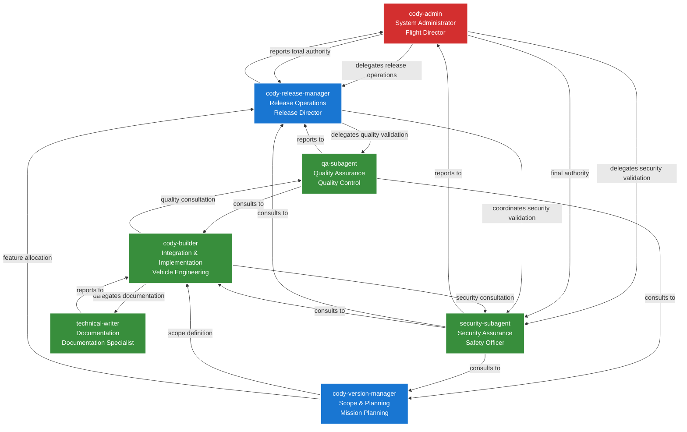
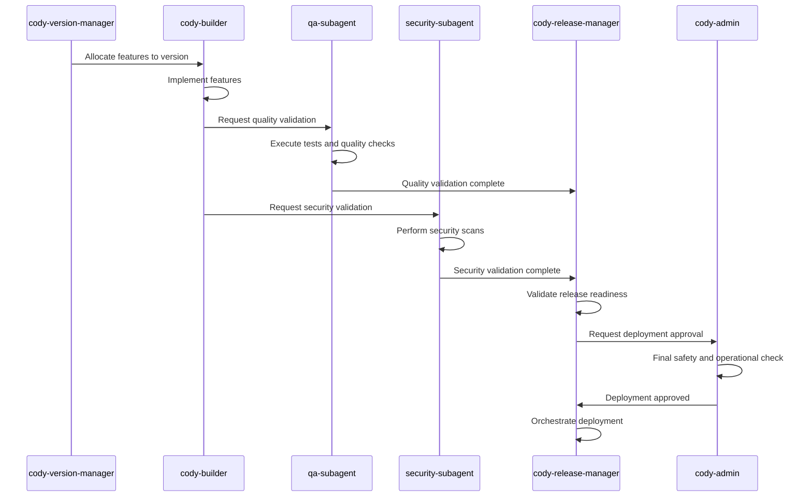
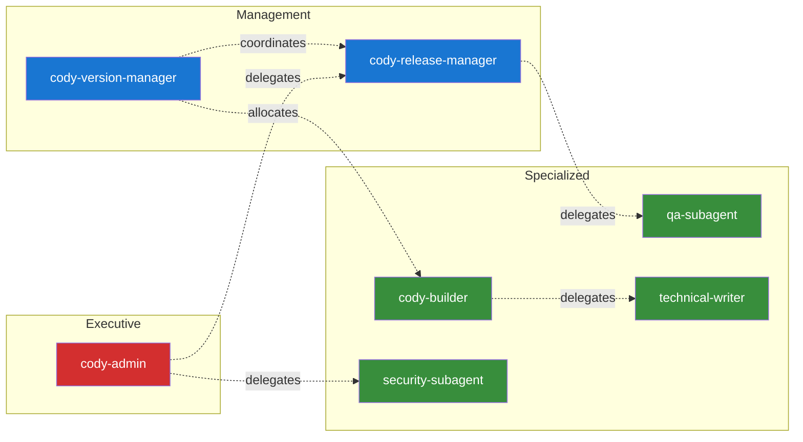

# Enhanced Agent Architecture Diagram

This document contains the Mermaid diagram for the enhanced agent architecture.

## Architecture Overview

## Release Process Flow

## Delegation Pattern Matrix

## Usage

To use these diagrams:

1. **View in Markdown**: Compatible with most Markdown viewers that support Mermaid
2. **Export**: Use MCP Mermaid server to export to PNG/SVG
3. **Edit**: Modify the Mermaid syntax to update the architecture
4. **Integration**: Include in documentation and presentations

The diagrams provide a visual representation of the enhanced agent architecture, showing clear delegation patterns and authority flows.