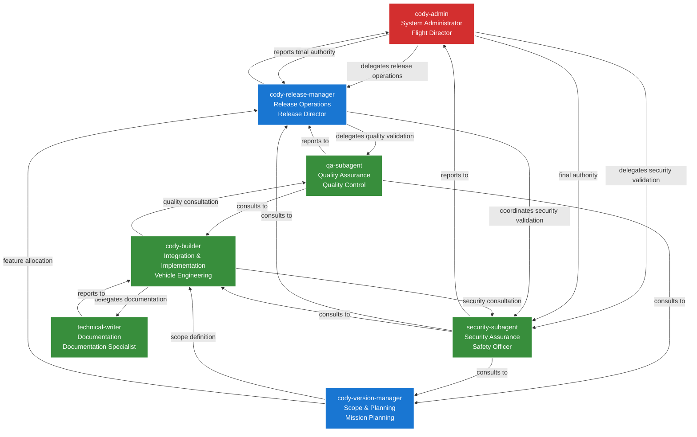

# Enhanced Agent Architecture

This document describes the enhanced agent architecture with specialized subagents for complete software development lifecycle management.

## Architecture Overview

The enhanced architecture provides clear separation of concerns, delegation patterns, and checks and balances for robust software development and deployment.

## Agent Roles and Responsibilities

### Executive Level

#### cody-admin (System Administrator)
- **Role**: Flight Director / System Authority
- **Primary Responsibilities**:
  - Production system ownership and safety
  - Final authority for deployment decisions
  - Delegates release operations to cody-release-manager
  - Delegates security validation to security-subagent
  - System maintenance and operations
- **Final Authority**: Production deployment "Go/No-Go"

### Management Level

#### cody-version-manager (Scope & Planning)
- **Role**: Mission Planning
- **Primary Responsibilities**:
  - Version scope definition and management
  - Feature backlog allocation to versions
  - Release scope validation
  - Version lifecycle management
  - Scope change management

#### cody-release-manager (Release Operations)
- **Role**: Release Director
- **Reports to**: cody-admin (delegated authority)
- **Primary Responsibilities**:
  - Release pipeline coordination
  - Release readiness validation
  - Delegates quality validation to qa-subagent
  - Coordinates security validation with security-subagent
  - Release process execution and monitoring

### Specialized Subagents

#### cody-builder (Integration & Implementation)
- **Role**: Vehicle Engineering
- **Primary Responsibilities**:
  - Code implementation and integration
  - Build automation and system integration
  - Testing implementation
  - Workflow automation
  - Deployment preparation (not execution)

#### qa-subagent (Quality Assurance)
- **Role**: Quality Control
- **Reports to**: cody-release-manager (for release validation)
- **Also serves**: cody-builder (during development)
- **Primary Responsibilities**:
  - Test strategy and execution
  - Quality gate enforcement
  - Performance and integration testing
  - Quality standards validation

#### security-subagent (Security Assurance)
- **Role**: Safety Officer
- **Reports to**: cody-admin (for production security)
- **Also serves**: cody-release-manager (for release security)
- **Primary Responsibilities**:
  - Security scanning and vulnerability assessment
  - Compliance validation
  - Security architecture review
  - Security clearance for releases

#### technical-writer (Documentation)
- **Role**: Documentation Specialist
- **Primary Responsibilities**:
  - Documentation creation and maintenance
  - User guides and tutorials
  - API documentation
  - Release notes and changelogs

## Delegation Patterns

### Release Delegation Chain
```
cody-admin (System Authority)
    ↓ delegates release operations
cody-release-manager (Release Operations)
    ↓ delegates quality validation
qa-subagent (Quality Assurance)
    ↓ coordinates security validation
security-subagent (Security Assurance)
```

### Feature Development Chain
```
cody-version-manager (Scope Definition)
    ↓ allocates features to version
cody-builder (Implementation)
    ↓ delegates documentation
technical-writer (Documentation)
```

## Release Governance

### Quality Gates
1. **cody-builder**: Implementation complete
2. **qa-subagent**: Quality standards met
3. **security-subagent**: Security requirements met
4. **cody-release-manager**: Release readiness confirmed
5. **cody-admin**: Production deployment approved

### Checks and Balances
- **qa-subagent** can block releases for quality issues
- **security-subagent** can block releases for security concerns
- **cody-release-manager** can halt releases for process issues
- **cody-admin** has final authority based on system safety

### Escalation Paths
- Quality issues → qa-subagent → cody-release-manager → cody-admin
- Security issues → security-subagent → cody-admin (direct)
- Process issues → cody-release-manager → cody-admin
- Scope issues → cody-version-manager → cody-release-manager

## Communication Protocols

### Standard Delegation Format
```
@target-agent perform-operation --context="..." --requirements="..."
```

### Status Reporting
- All subagents provide status updates to their reporting manager
- Critical issues escalate immediately up the chain
- Regular coordination meetings between managers

### Decision Authority
- **Operational decisions**: Made by responsible subagent
- **Strategic decisions**: Made by managing agent
- **Final authority**: cody-admin for production systems

## Implementation Requirements

### Configuration Files
Each subagent requires:
- Agent configuration JSON file
- Capability definitions
- Delegation pattern specifications
- Permission matrix entries

### Integration Points
- MCP server configurations for specialized tools
- Permission matrix updates for new agents
- Delegation pattern implementations
- Communication protocol definitions

### Testing Requirements
- Unit tests for each agent's core functionality
- Integration tests for delegation patterns
- End-to-end tests for release governance
- Security validation tests

## Architecture Diagram



## Benefits

1. **Clear Separation of Concerns**: Each agent has well-defined responsibilities
2. **Specialized Expertise**: Dedicated agents for each domain
3. **Robust Governance**: Multiple checkpoints and validation layers
4. **Scalability**: Easy to add new specialized agents
5. **Accountability**: Clear ownership and authority chains
6. **Risk Mitigation**: Multiple layers of review and validation

## Migration Path

1. Create new subagent configurations
2. Update existing agents with delegation patterns
3. Implement communication protocols
4. Test delegation chains
5. Gradual rollout with monitoring
6. Full deployment with governance in place