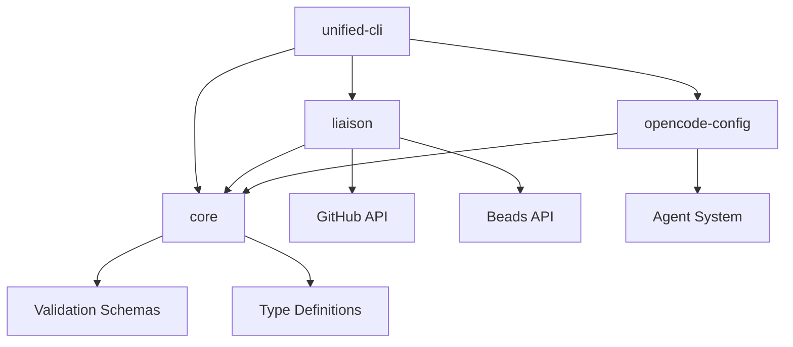

# v0.5.0 Unified Architecture Design

## Executive Summary

This document outlines the comprehensive architecture for v0.5.0 unified release, focusing on seamless integration between `liaison` and `opencode_config` packages while maintaining clean separation of concerns, enhanced performance, and improved maintainability.

## Current State Analysis

### Strengths
- **Comprehensive Testing**: 8-category testing strategy with unit, integration, E2E, BDD, security, accessibility, performance, and mutation testing
- **Modern Tooling**: Just task runner, Bun runtime, uv package manager, Turborepo orchestration
- **Cross-Platform Support**: Works on macOS, Linux, and Windows
- **Rich Feature Set**: Sync engine, configuration management, template system, CLI integration

### Current Issues
- **Tight Coupling**: Direct dependencies between packages create circular dependencies
- **Configuration Duplication**: Similar validation logic in both packages
- **Inconsistent Error Handling**: Different error patterns across TypeScript and Python code
- **Performance Bottlenecks**: Synchronous operations in critical paths
- **Maintenance Overhead**: Duplicate type definitions and validation schemas

## 1. Package Architecture

### 1.1 Proposed Structure

```
packages/
├── core/                          # NEW: Shared core library
│   ├── types/                     # Unified type definitions
│   ├── validation/                # Shared validation logic
│   ├── errors/                    # Standardized error handling
│   └── utils/                     # Common utilities
├── liaison/        # Enhanced sync engine
│   ├── src/
│   │   ├── sync/                  # Core sync functionality
│   │   ├── clients/               # API clients (GitHub, Beads)
│   │   ├── commands/              # CLI commands
│   │   └── templates/             # Project templates
├── opencode-config/               # Enhanced configuration
│   ├── src/
│   │   ├── config/                # Configuration management
│   │   ├── schemas/               # JSON schemas
│   │   ├── cli/                   # Python CLI
│   │   └── agents/                # Agent configurations
└── unified-cli/                   # NEW: Unified command interface
    ├── src/
    │   ├── commands/              # Unified commands
    │   ├── plugins/               # Package plugins
    │   └── middleware/            # CLI middleware
```

### 1.2 Dependency Graph



### 1.3 Core Library Design

**Location**: `packages/core/`

**Purpose**: Shared functionality, types, and utilities

**Key Components**:

```typescript
// packages/core/types/index.ts
export interface UnifiedConfig {
  version: string;
  github: GitHubConfig;
  cody: CodyConfig;
  beads: BeadsConfig;
  sync: SyncConfig;
  agents: AgentConfig;
  templates: TemplateConfig;
}

// packages/core/validation/index.ts
export class UnifiedValidator {
  validateConfig(config: any): ValidationResult;
  validateSyncOptions(options: any): ValidationResult;
  validateAgentConfig(config: any): ValidationResult;
}

// packages/core/errors/index.ts
export class OpenCodeError extends Error {
  constructor(code: string, message: string, details?: any);
}

export const ErrorCodes = {
  CONFIG_INVALID: 'CONFIG_INVALID',
  SYNC_CONFLICT: 'SYNC_CONFLICT',
  API_FAILURE: 'API_FAILURE',
  AGENT_ERROR: 'AGENT_ERROR'
} as const;
```

## 2. CLI Integration

### 2.1 Unified Command Structure

**Primary CLI**: `opencode` (from `unified-cli` package)

```bash
# Core commands
opencode init                    # Initialize project
opencode config                  # Configuration management
opencode sync                    # Synchronization
opencode template                # Template management

# Package-specific commands
opencode cody sync              # Cody-specific sync
opencode beads sync             # Beads-specific sync
opencode agent create           # Agent management
opencode config validate        # Configuration validation

# Development commands
opencode dev                     # Development mode
opencode test                    # Run tests
opencode build                   # Build packages
opencode deploy                  # Deploy packages
```

### 2.2 Plugin Architecture

```typescript
// packages/unified-cli/src/plugins/Plugin.ts
export interface CLIPlugin {
  name: string;
  version: string;
  commands: CommandDefinition[];
  middleware?: Middleware[];
  hooks?: Hook[];
}

// packages/unified-cli/src/plugins/cody-plugin.ts
export const CodyPlugin: CLIPlugin = {
  name: 'liaison',
  version: '0.5.0',
  commands: [
    {
      name: 'cody sync',
      description: 'Sync Cody and Beads',
      handler: syncHandler,
      options: syncOptions
    }
  ]
};
```

### 2.3 Middleware System

```typescript
// packages/unified-cli/src/middleware/
export interface Middleware {
  name: string;
  execute(context: CLIContext, next: () => Promise<void>): Promise<void>;
}

export class ConfigMiddleware implements Middleware {
  async execute(context: CLIContext, next: () => Promise<void>): Promise<void> {
    // Load and validate configuration
    context.config = await this.loadConfig(context.args.config);
    await next();
  }
}

export class ErrorHandlingMiddleware implements Middleware {
  async execute(context: CLIContext, next: () => Promise<void>): Promise<void> {
    try {
      await next();
    } catch (error) {
      this.handleError(error, context);
    }
  }
}
```

## 3. Sync Engine Design

### 3.1 Enhanced Architecture

```typescript
// packages/cody-beads-integration/src/sync/SyncEngine.ts
export class SyncEngine {
  constructor(
    private config: UnifiedConfig,
    private clients: Map<string, APIClient>,
    private conflictResolver: ConflictResolver,
    private eventBus: EventBus
  ) {}

  async executeSync(options: SyncOptions): Promise<SyncResult> {
    const syncContext = await this.createSyncContext(options);
    
    // Phase 1: Discovery
    const discovery = await this.discoverItems(syncContext);
    
    // Phase 2: Conflict Detection
    const conflicts = await this.detectConflicts(discovery, syncContext);
    
    // Phase 3: Resolution Strategy
    const resolution = await this.resolveConflicts(conflicts, syncContext);
    
    // Phase 4: Synchronization
    const results = await this.performSync(resolution, syncContext);
    
    // Phase 5: Validation
    await this.validateResults(results, syncContext);
    
    return results;
  }
}
```

### 3.2 Bidirectional Synchronization Patterns

```typescript
// packages/cody-beads-integration/src/sync/patterns/
export interface SyncPattern {
  name: string;
  canHandle(context: SyncContext): boolean;
  execute(context: SyncContext): Promise<SyncResult>;
}

export class BidirectionalPattern implements SyncPattern {
  async execute(context: SyncContext): Promise<SyncResult> {
    // 1. Create sync graph
    const graph = await this.buildSyncGraph(context);
    
    // 2. Topological sort for dependency order
    const sortedItems = this.topologicalSort(graph);
    
    // 3. Execute sync in batches
    const batches = this.createBatches(sortedItems);
    
    // 4. Process each batch
    for (const batch of batches) {
      await this.processBatch(batch, context);
    }
    
    return this.compileResults();
  }
}
```

### 3.3 Conflict Resolution Strategies

```typescript
// packages/cody-beads-integration/src/sync/conflict/
export class ConflictResolver {
  private strategies: Map<ConflictType, ResolutionStrategy>;

  constructor() {
    this.strategies = new Map([
      [ConflictType.DATA_CONFLICT, new DataConflictStrategy()],
      [ConflictType.TIMESTAMP_CONFLICT, new TimestampStrategy()],
      [ConflictType.DELETION_CONFLICT, new DeletionStrategy()],
      [ConflictType.DEPENDENCY_CONFLICT, new DependencyStrategy()]
    ]);
  }

  async resolve(conflict: SyncConflict, context: SyncContext): Promise<Resolution> {
    const strategy = this.strategies.get(conflict.type);
    if (!strategy) {
      throw new Error(`No strategy for conflict type: ${conflict.type}`);
    }
    
    return strategy.resolve(conflict, context);
  }
}
```

## 4. Configuration Management

### 4.1 Unified Configuration System

```typescript
// packages/core/config/UnifiedConfigManager.ts
export class UnifiedConfigManager {
  private loaders: Map<string, ConfigLoader>;
  private validators: Map<string, ConfigValidator>;
  private mergers: ConfigMerger[];

  constructor() {
    this.loaders = new Map([
      ['json', new JSONConfigLoader()],
      ['yaml', new YAMLConfigLoader()],
      ['env', new EnvConfigLoader()]
    ]);
    
    this.validators = new Map([
      ['schema', new SchemaValidator()],
      ['business', new BusinessRuleValidator()]
    ]);
  }

  async loadConfig(configPath?: string): Promise<UnifiedConfig> {
    // 1. Discover configuration files
    const configFiles = await this.discoverConfigFiles(configPath);
    
    // 2. Load configurations in priority order
    const configs = await this.loadConfigurations(configFiles);
    
    // 3. Merge configurations
    const merged = this.mergeConfigurations(configs);
    
    // 4. Validate merged configuration
    await this.validateConfiguration(merged);
    
    return merged;
  }
}
```

### 4.2 Configuration Hierarchy

```
Configuration Priority (highest to lowest):
1. Command-line arguments
2. Environment variables
3. Project configuration (.opencode/config.json)
4. Workspace configuration (workspace.json)
5. Global configuration (~/.opencode/config.json)
6. Default configuration
```

### 4.3 Schema-Driven Validation

```json
// packages/core/schemas/unified-config.schema.json
{
  "$schema": "http://json-schema.org/draft-07/schema#",
  "title": "OpenCode Unified Configuration",
  "type": "object",
  "properties": {
    "version": {
      "type": "string",
      "pattern": "^\\d+\\.\\d+\\.\\d+$"
    },
    "github": {
      "$ref": "#/definitions/GitHubConfig"
    },
    "cody": {
      "$ref": "#/definitions/CodyConfig"
    },
    "beads": {
      "$ref": "#/definitions/BeadsConfig"
    },
    "sync": {
      "$ref": "#/definitions/SyncConfig"
    }
  },
  "required": ["version", "github"],
  "additionalProperties": false
}
```

## 5. Release Strategy

### 5.1 Coordinated Release Process

```yaml
# .github/workflows/release.yml
name: Unified Release v0.5.0

on:
  push:
    tags:
      - 'v0.5.0'

jobs:
  validate:
    runs-on: ubuntu-latest
    steps:
      - uses: actions/checkout@v4
      - name: Setup Environment
        run: just setup
      - name: Run All Tests
        run: just test
      - name: Security Scan
        run: just security-scan

  build:
    needs: validate
    runs-on: ${{ matrix.os }}
    strategy:
      matrix:
        os: [ubuntu-latest, macos-latest, windows-latest]
    steps:
      - uses: actions/checkout@v4
      - name: Build Packages
        run: just build

  publish:
    needs: build
    runs-on: ubuntu-latest
    steps:
      - uses: actions/checkout@v4
      - name: Publish to NPM
        run: just publish:npm
      - name: Publish to PyPI
        run: just publish:pypi
      - name: Create GitHub Release
        uses: actions/create-release@v1
```

### 5.2 Version Management

```json
// package.json (root)
{
  "name": "opencode-workflow-kit",
  "version": "0.5.0",
  "workspaces": [
    "packages/core",
    "packages/liaison",
    "packages/opencode-config",
    "packages/unified-cli"
  ]
}
```

### 5.3 Automated Changelog Generation

```typescript
// scripts/generate-changelog.ts
export class ChangelogGenerator {
  async generate(version: string): Promise<string> {
    const commits = await this.getCommitsSinceLastRelease();
    const changes = this.categorizeChanges(commits);
    
    return this.formatChangelog(version, changes);
  }

  private categorizeChanges(commits: Commit[]): ChangeCategories {
    return {
      features: commits.filter(c => c.type === 'feat'),
      fixes: commits.filter(c => c.type === 'fix'),
      breaking: commits.filter(c => c.type === 'breaking'),
      dependencies: commits.filter(c => c.type === 'deps')
    };
  }
}
```

## 6. Testing Strategy

### 6.1 Integration Testing Architecture

```typescript
// packages/core/testing/TestEnvironment.ts
export class TestEnvironment {
  private containers: Map<string, TestContainer>;
  private mocks: Map<string, MockService>;

  async setup(): Promise<void> {
    // Start test containers
    this.containers.set('github', new GitHubMockContainer());
    this.containers.set('beads', new BeadsMockContainer());
    
    // Initialize mock services
    this.mocks.set('config', new ConfigMockService());
    this.mocks.set('sync', new SyncMockService());
  }

  async teardown(): Promise<void> {
    // Cleanup containers and mocks
    for (const container of this.containers.values()) {
      await container.stop();
    }
  }
}
```

### 6.2 Cross-Package Integration Tests

```typescript
// tests/integration/unified-workflow.test.ts
describe('Unified Workflow Integration', () => {
  let env: TestEnvironment;

  beforeAll(async () => {
    env = new TestEnvironment();
    await env.setup();
  });

  afterAll(async () => {
    await env.teardown();
  });

  test('complete sync workflow', async () => {
    // 1. Initialize project
    const initResult = await runCommand('opencode init --template minimal');
    expect(initResult.success).toBe(true);

    // 2. Configure sync
    const configResult = await runCommand('opencode config set sync.direction bidirectional');
    expect(configResult.success).toBe(true);

    // 3. Execute sync
    const syncResult = await runCommand('opencode sync --dry-run');
    expect(syncResult.success).toBe(true);
    expect(syncResult.data.issuesSynced).toBeGreaterThan(0);
  });
});
```

### 6.3 Performance Testing

```typescript
// tests/performance/sync-performance.test.ts
describe('Sync Performance', () => {
  test('large dataset sync performance', async () => {
    const startTime = Date.now();
    
    // Create large dataset (10,000 issues)
    const dataset = await createLargeDataset(10000);
    
    // Execute sync
    const result = await syncEngine.executeSync({
      direction: 'bidirectional',
      dryRun: false
    });

    const duration = Date.now() - startTime;
    
    // Performance assertions
    expect(duration).toBeLessThan(30000); // 30 seconds max
    expect(result.success).toBe(true);
    expect(result.issuesSynced).toBe(10000);
  });
});
```

## 7. Implementation Roadmap

### Phase 1: Core Library (Week 1-2)
- [ ] Create `packages/core` with shared types
- [ ] Implement unified validation system
- [ ] Standardize error handling
- [ ] Create configuration management base

### Phase 2: CLI Unification (Week 3-4)
- [ ] Build `packages/unified-cli`
- [ ] Implement plugin architecture
- [ ] Create middleware system
- [ ] Migrate existing commands

### Phase 3: Enhanced Sync Engine (Week 5-6)
- [ ] Refactor sync engine with new patterns
- [ ] Implement advanced conflict resolution
- [ ] Add performance optimizations
- [ ] Create comprehensive test suite

### Phase 4: Configuration Integration (Week 7-8)
- [ ] Unify configuration systems
- [ ] Implement schema-driven validation
- [ ] Create configuration migration tools
- [ ] Add configuration testing

### Phase 5: Testing & Documentation (Week 9-10)
- [ ] Implement integration test suite
- [ ] Add performance benchmarks
- [ ] Create comprehensive documentation
- [ ] Prepare release artifacts

## 8. Migration Strategy

### 8.1 Backward Compatibility

```typescript
// packages/core/compatibility/LegacyAdapter.ts
export class LegacyAdapter {
  adaptConfigV0_4(legacyConfig: any): UnifiedConfig {
    return {
      version: '0.5.0',
      github: this.adaptGitHubConfig(legacyConfig.github),
      cody: this.adaptCodyConfig(legacyConfig.cody),
      beads: this.adaptBeadsConfig(legacyConfig.beads),
      sync: this.adaptSyncConfig(legacyConfig.sync),
      agents: this.adaptAgentConfig(legacyConfig.agents),
      templates: this.adaptTemplateConfig(legacyConfig.templates)
    };
  }
}
```

### 8.2 Migration Tools

```bash
# Migration command
opencode migrate --from-version 0.4.0 --to-version 0.5.0

# Configuration validation
opencode config validate --migrate

# Dry-run migration
opencode migrate --dry-run --show-changes
```

## 9. Performance Optimizations

### 9.1 Async Operations

```typescript
// Convert synchronous operations to async
export class AsyncConfigLoader {
  async loadConfig(path: string): Promise<UnifiedConfig> {
    const [fileConfig, envConfig, cliConfig] = await Promise.all([
      this.loadFileConfig(path),
      this.loadEnvConfig(),
      this.loadCliConfig()
    ]);

    return this.mergeConfigs([cliConfig, envConfig, fileConfig]);
  }
}
```

### 9.2 Caching Strategy

```typescript
// packages/core/cache/ConfigCache.ts
export class ConfigCache {
  private cache = new Map<string, CacheEntry>();

  async get(key: string): Promise<UnifiedConfig | null> {
    const entry = this.cache.get(key);
    if (!entry || this.isExpired(entry)) {
      return null;
    }
    return entry.config;
  }

  async set(key: string, config: UnifiedConfig, ttl: number = 300000): Promise<void> {
    this.cache.set(key, {
      config,
      timestamp: Date.now(),
      ttl
    });
  }
}
```

### 9.3 Batch Processing

```typescript
// packages/liaison/src/sync/BatchProcessor.ts
export class BatchProcessor {
  async processBatch<T, R>(
    items: T[],
    processor: (item: T) => Promise<R>,
    batchSize: number = 100
  ): Promise<R[]> {
    const results: R[] = [];
    
    for (let i = 0; i < items.length; i += batchSize) {
      const batch = items.slice(i, i + batchSize);
      const batchResults = await Promise.all(
        batch.map(item => processor(item))
      );
      results.push(...batchResults);
    }
    
    return results;
  }
}
```

## 10. Security Enhancements

### 10.1 Secret Management

```typescript
// packages/core/security/SecretManager.ts
export class SecretManager {
  async getSecret(key: string): Promise<string | null> {
    // Check environment variables
    if (process.env[key]) {
      return process.env[key];
    }

    // Check system keychain
    const keychainSecret = await this.getKeychainSecret(key);
    if (keychainSecret) {
      return keychainSecret;
    }

    // Check encrypted config
    const configSecret = await this.getConfigSecret(key);
    if (configSecret) {
      return configSecret;
    }

    return null;
  }
}
```

### 10.2 Input Validation

```typescript
// packages/core/security/InputValidator.ts
export class InputValidator {
  validatePath(path: string): boolean {
    // Prevent path traversal attacks
    const normalized = path.normalize(path);
    return !normalized.includes('..') && !normalized.startsWith('/');
  }

  validateUrl(url: string): boolean {
    try {
      const parsed = new URL(url);
      return ['http:', 'https:'].includes(parsed.protocol);
    } catch {
      return false;
    }
  }
}
```

## Conclusion

The v0.5.0 unified architecture provides a solid foundation for future development while addressing current issues and improving maintainability. The modular design ensures clean separation of concerns, enhanced performance, and easier testing.

Key benefits:
- **Unified CLI**: Single entry point for all operations
- **Shared Core**: Reduced duplication and consistent behavior
- **Enhanced Sync**: More robust and performant synchronization
- **Better Testing**: Comprehensive integration testing
- **Improved Security**: Centralized secret management and validation

This architecture positions the project for long-term success and scalability while maintaining backward compatibility and providing clear migration paths.