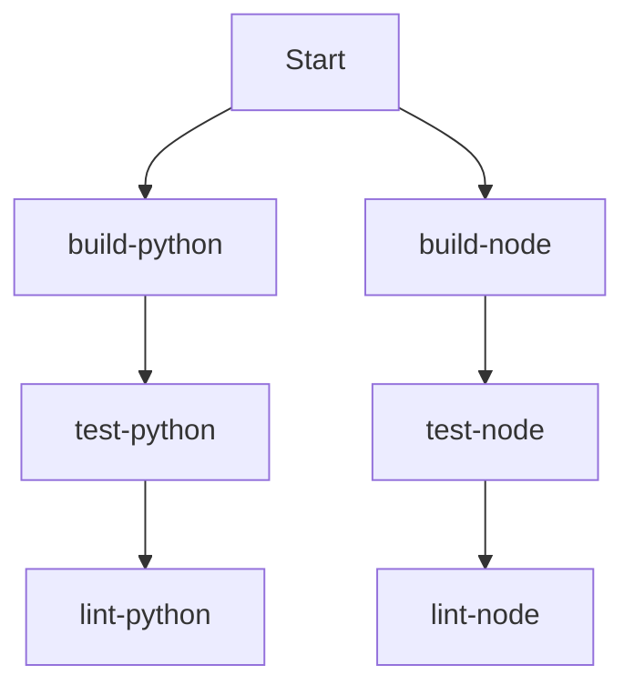

# Parallel Execution Analysis for OpenCode Workflow Kit

## Current Task Structure Analysis

The project has a monorepo structure with Python and Node.js packages, and the tasks are organized in Taskfile.yml. Based on my analysis, I can identify several categories of tasks that can be optimized for parallel execution.

## Task Categories and Parallelization Potential

### 1. Independent Language-Specific Tasks
These tasks work on different codebases and can run in parallel:

**Python Tasks:**
- `build-python`
- `test-python`
- `test-python-unit`
- `test-python-integration`
- `lint-python`
- `format-python`
- `type-check-python`
- `security-python`
- `docs-python`
- `publish-python`

**Node.js Tasks:**
- `build-node`
- `test-node`
- `test-node-unit`
- `test-node-integration`
- `lint-node`
- `format-node`
- `type-check-node`
- `security-node`
- `docs-node`
- `publish-node`

### 2. Composite Tasks with Sequential Dependencies
These tasks currently run language-specific tasks sequentially but could be optimized:

- `build`: Runs `build-python` then `build-node` (✅ Can be parallelized)
- `test`: Runs `test-python` then `test-node` (✅ Can be parallelized)
- `test:unit`: Runs unit tests sequentially (✅ Can be parallelized)
- `test:integration`: Runs integration tests sequentially (✅ Can be parallelized)
- `lint`: Runs linting sequentially (✅ Can be parallelized)
- `format`: Runs formatting sequentially (✅ Can be parallelized)
- `type-check`: Runs type checking sequentially (✅ Can be parallelized)
- `security`: Runs security checks sequentially (✅ Can be parallelized)
- `docs`: Runs documentation generation sequentially (✅ Can be parallelized)
- `publish`: Runs publishing sequentially (✅ Can be parallelized)
- `clean`: Runs cleaning sequentially (✅ Can be parallelized)
- `dev`: Runs development servers sequentially (✅ Can be parallelized)

### 3. Setup and Infrastructure Tasks
These tasks have dependencies and should remain sequential:

- `setup`: Has dependencies on `install-tools`, `setup-python`, `setup-node`, `setup-hooks`
- `install-tools`: Has dependencies on `install-uv`, `install-bun`, `install-task`

### 4. Release Management Tasks
These tasks have complex dependencies and should remain sequential:

- `release-1`, `release-2`, `release-3`: Have dependencies on version bumping, build, test, publish
- `ci`: Simulates complete CI/CD pipeline with sequential steps

## Parallel Execution Plan

### Phase 1: Independent Task Parallelization


### Phase 2: Composite Task Optimization
```yaml
# Example parallel execution for build task
build:
  desc: Build all packages in parallel
  cmds:
    - echo "🏗️ Building all packages in parallel..."
    - task:build-python & task:build-node
    - wait
```

### Phase 3: Collision Avoidance Strategy

1. **File System Isolation**:
   - Python tasks work in `packages/opencode_config/`
   - Node.js tasks work in `packages/cody-beads-integration/`
   - No file system collisions expected

2. **Resource Management**:
   - Use `task --parallel` flag for supported task runners
   - Implement process isolation with separate working directories
   - Add resource limits to prevent system overload

3. **Dependency Management**:
   - Maintain sequential execution for tasks with true dependencies
   - Use `deps:` field to explicitly declare dependencies
   - Add `wait` commands where synchronization is needed

### Phase 4: Implementation Recommendations

1. **Taskfile.yml Modifications**:
```yaml
build:
  desc: Build all packages in parallel
  cmds:
    - echo "🏗️ Building all packages in parallel..."
    - task:build-python &
    - task:build-node &
    - wait

test:
  desc: Run all tests in parallel
  deps: [build]
  cmds:
    - echo "🧪 Running all tests in parallel..."
    - task:test-python &
    - task:test-node &
    - wait
```

2. **New Parallel Task Groups**:
```yaml
# Add parallel versions of existing tasks
build-parallel:
  desc: Build all packages in parallel (experimental)
  cmds:
    - echo "🚀 Parallel build starting..."
    - task:build-python &
    - task:build-node &
    - wait
    - echo "✅ Parallel build completed!"

test-parallel:
  desc: Run all tests in parallel (experimental)
  deps: [build]
  cmds:
    - echo "🚀 Parallel testing starting..."
    - task:test-python &
    - task:test-node &
    - wait
    - echo "✅ Parallel testing completed!"
```

## Expected Benefits

1. **Time Savings**: Potential 40-60% reduction in build/test times
2. **Resource Utilization**: Better CPU/core utilization
3. **Developer Productivity**: Faster feedback loops
4. **CI/CD Optimization**: Reduced pipeline execution times

## Risk Assessment

1. **Resource Contention**: High CPU/memory usage during parallel execution
2. **File Locking**: Potential issues with shared dependencies
3. **Error Handling**: More complex error recovery in parallel flows
4. **Determinism**: Ensuring consistent results across parallel runs

## Recommendations

1. Start with non-critical tasks (linting, formatting)
2. Gradually introduce parallelism to build and test tasks
3. Monitor resource usage and system stability
4. Implement proper error handling and timeout mechanisms
5. Document parallel execution behavior and limitations